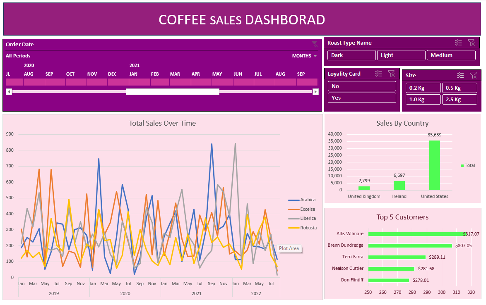
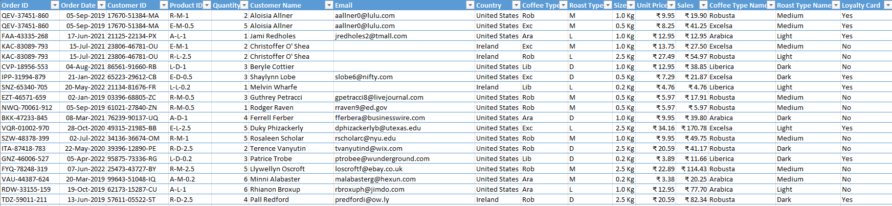
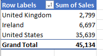
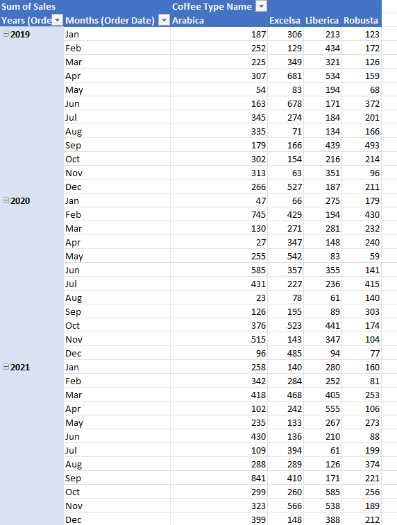

# Coffee Sales Dashboard (Excel)

Interactive sales dashboard built on a three-table order dataset: 1,000 order lines, 1,000 customers and 48 products, covering January 2019 to August 2022 across the United States, Ireland and the United Kingdom.



## Summary

| Metric | Result |
|---|---|
| Total sales | $45,134 |
| Largest market | United States, 79.0% of revenue |
| Top revenue pack size | 2.5 kg, 52.7% of revenue |
| Coffee type spread | 20.0% (Robusta) to 27.3% (Excelsa) |
| Strongest full year | 2021, $13,766 |
| Loyalty card holders | 46.3% of revenue |

## Background

I served 20 years in the Indian Air Force (December 2005 to December 2025) as a Radio Fitter and retired as a Sergeant. The work covered maintenance and fault diagnosis of radio communication equipment, inspection and serviceability records, fault analysis, and technical reporting through the chain of command. Records in that environment had to be accurate and traceable before anyone acted on them.

This project applies the same standard to commercial data. The domain is different; the workflow of integrating records, checking them, calculating the measures that matter and reporting them clearly is the same.

## Business questions

- How are sales trending over time, and which year performed best?
- Which markets, coffee types and roast types drive revenue?
- How much does pack size matter to revenue?
- Who are the highest-value customers?
- Do loyalty card holders spend more than other customers?

## Data model

The source workbook is a simple star schema. `orders` is the fact table and holds only keys and quantity; `customers` and `products` are dimension tables.

| Table | Rows | Key | Content |
|---|---:|---|---|
| orders | 1,000 | Order ID + Product ID | Order date, customer ID, product ID, quantity |
| customers | 1,000 | Customer ID | Name, contact details, city, country, loyalty card |
| products | 48 | Product ID | Coffee type, roast, pack size (kg), unit price, price per 100 g, profit |

Full field definitions are in [docs/data_dictionary.md](docs/data_dictionary.md).

## Data quality checks

- Referential integrity: every Customer ID and Product ID in `orders` matches its dimension table, so no lookup returns an error.
- Duplicates: no fully duplicated rows. The 1,000 lines belong to 957 orders because multi-product orders appear once per product, which is expected rather than a data error.
- Missing values: none in `orders` or `products`. In `customers`, 204 emails and 130 phone numbers are blank. Blank emails would surface as 0 through XLOOKUP, so the email formula returns an empty string instead.
- Coverage: 2022 contains January to August only, so it is excluded from year-on-year comparison.

## Method

**Integration.** Customer name, email and country are brought into `orders` with XLOOKUP on Customer ID. Product attributes (coffee type, roast, size, unit price) use a single two-way INDEX/MATCH where the column MATCH reads the header of the current column. One formula therefore fills four columns, with mixed references ($D2, I$1) keeping it correct when copied across and down.

**Transformation.** Sales is calculated as unit price x quantity. Product codes are mapped to readable labels (Ara to Arabica, M to Medium and so on). The dataset is held in an Excel Table so formulas, structured references and pivot sources extend automatically as rows are added.

**Analysis and reporting.** Three PivotTables feed the dashboard: monthly sales by coffee type, sales by country, and top five customers. A timeline on order date and slicers for roast type, pack size and loyalty card are connected to all three, so any filter applies across the whole view. Pack size, roast and loyalty results below were read through those slicers.

Every formula is written out in [docs/formulas.md](docs/formulas.md).

## Findings

**Revenue is concentrated in one market.** The US accounts for $35,639 (79.0%). Ireland contributes 14.8% and the UK 6.2%. Any change in US demand would move the whole business.

**Pack size matters more than product choice.** The 2.5 kg pack brings in 52.7% of revenue, against 7.3% for the 0.2 kg pack. By contrast, the four coffee types sit within a narrow band of 20% to 27%, and light roast leads roasts at 38.5%. Revenue is driven by how much customers buy per order more than by which coffee they choose.

**The loyalty card is not associated with higher total spend.** Card holders account for 46.3% of revenue, non-holders 53.7%. This is total spend only; a fair assessment needs spend per customer, purchase frequency and repeat rate for each group before concluding anything about the scheme.

**Sales were flat, then grew.** 2019 ($12,187) and 2020 ($12,118) are almost level, and 2021 rose 13.6% to $13,766. 2022 reached $7,063 by August.

## Screenshots

Enriched orders table after integration and transformation:



PivotTables feeding the dashboard:





## Limitations and next steps

- Findings are based on revenue. The products table includes a profit field, and the next step is margin by pack size and coffee type to check whether the 2.5 kg pack is the most profitable line or only the largest.
- The loyalty comparison needs customer-level metrics (average order value, orders per customer, repeat purchase rate).
- Country by product analysis would show whether the US pattern holds in Ireland and the UK, which matters for any growth decision outside the US.

## Repository structure

```text
excel-coffee-sales-dashboard/
├── README.md
├── data/
│   └── coffeeOrdersData_raw.xlsx          source data, three sheets
├── workbook/
│   └── coffeeOrdersData_dashboard.xlsx    finished workbook and dashboard
├── docs/
│   ├── data_dictionary.md                 field definitions and data quality notes
│   └── formulas.md                        every formula with explanation
└── images/
    ├── dashboard.png
    ├── orders_table.png
    ├── pivot_tables.png
    └── pivot_tables1.png
```

## How to use

Download `workbook/coffeeOrdersData_dashboard.xlsx` and open the Dashboard sheet in Excel 2021 or Microsoft 365 (XLOOKUP and the timeline need a recent version). Filter with the timeline and slicers.

## Attribution

The dataset and original project concept come from Mo Chen's [excel-project-coffee-sales](https://github.com/mochen862/excel-project-coffee-sales). The workbook was rebuilt independently; the data quality checks, documentation, findings and recommendations in this repository are my own.

## About me

Nagendra Kumar. Retired Sergeant, Indian Air Force (20 years, radio communication and technical operations). MCA, and currently completing an MS in Data Science from IIIT Bangalore and Liverpool John Moores University. Working with Excel, SQL (MySQL), Python and PySpark, and moving into Data Analyst roles.

LinkedIn: [linkedin.com/in/nagendrakumartripathi](https://www.linkedin.com/in/nagendrakumartripathi)
Email: nagendratripathi89@gmail.com
